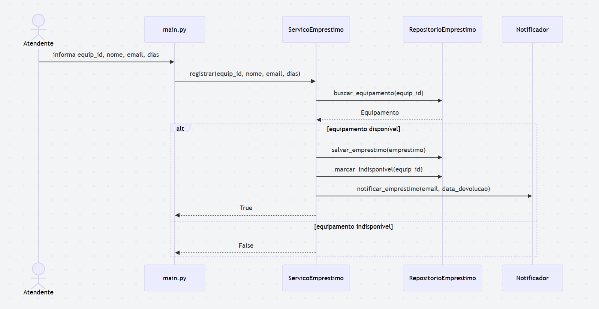
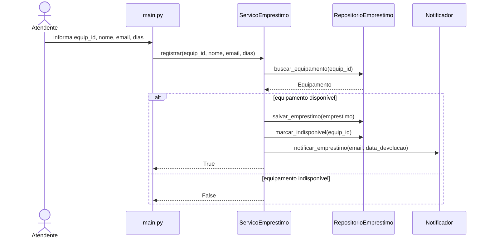
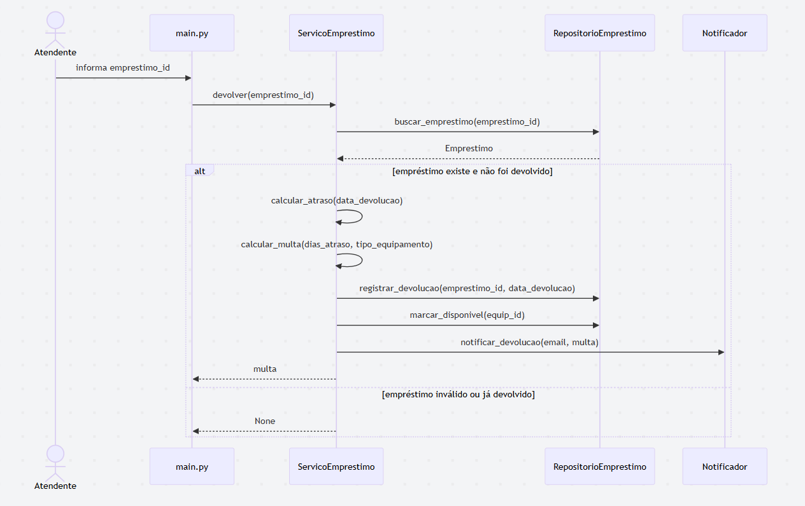
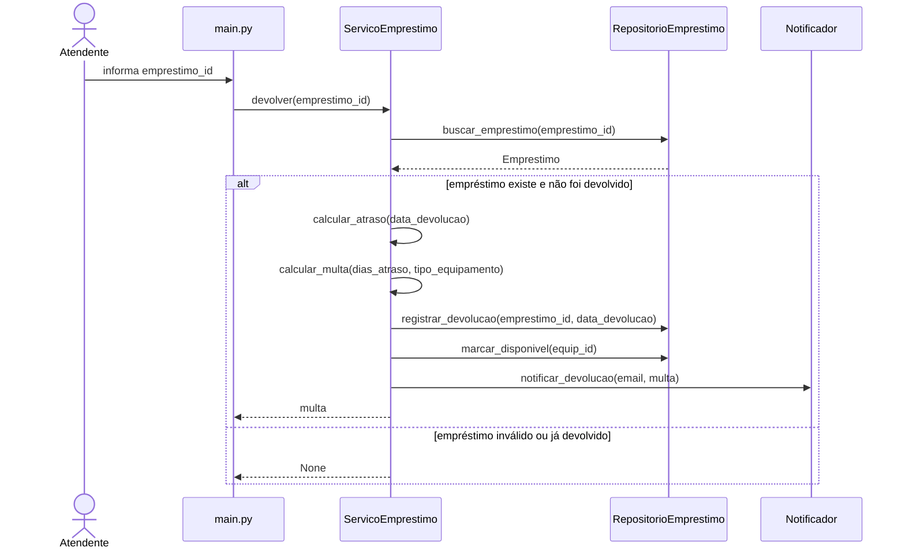
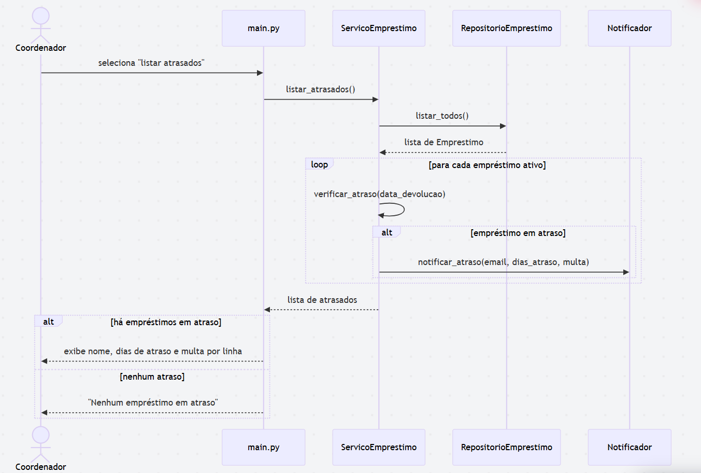
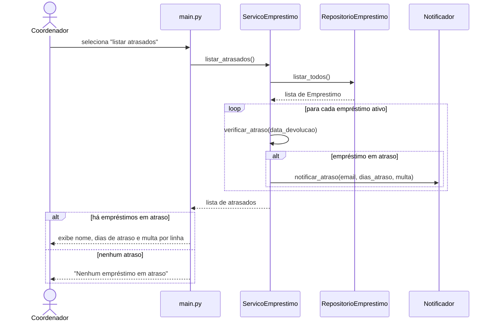

# Diagramas e Decomposição

## Decomposição em camadas

Arquitetura de referência: ADR-001 (duas camadas — `cli/` e `negocio/`).

| Classe / Módulo                      | Camada     | Justificativa                                                                                                                                                                                                                             |
| ------------------------------------ | ---------- | ----------------------------------------------------------------------------------------------------------------------------------------------------------------------------------------------------------------------------------------- |
| `models/Equipamento`                 | `negocio/` | Tipo do domínio com alta coesão: agrupa apenas os atributos e o estado de um equipamento, sem lógica de interface ou persistência.                                                                                                        |
| `models/Emprestimo`                  | `negocio/` | Tipo do domínio que representa o vínculo entre um equipamento e um aluno; encapsula as regras de data e multa, isolando o conceito de negócio de qualquer detalhe de I/O.                                                                 |
| `services/ServicoEmprestimo`         | `negocio/` | Concentra os três casos de uso do fluxo principal (registrar, devolver, listar atrasados); tem um único motivo para mudar — a regra de negócio de empréstimo —, satisfazendo o princípio de responsabilidade única (SRP, Cap. 5 Valente). |
| `services/Notificador`               | `negocio/` | Isola o canal de aviso ao usuário; separado de `ServicoEmprestimo` porque mudar o meio de notificação (console, e-mail, SMS) não deve exigir alteração na lógica de empréstimo — ocultamento de informação aplicado à camada de serviço.  |
| `repositories/RepositorioEmprestimo` | `negocio/` | Esconde o mecanismo de armazenamento (lista em memória, arquivo, banco) atrás de uma interface estável; reduz o acoplamento de `ServicoEmprestimo` com a infraestrutura de persistência.                                                  |
| `main.py` / `cli/App`                | `cli/`     | Ponto de entrada que apenas lê comandos do usuário e delega para `ServicoEmprestimo`; não contém regra de negócio, garantindo separação entre apresentação e domínio (ADR-001).                                                           |

---

## Diagramas de sequência

### UC01 — Registrar Empréstimo

### UC02 — Registrar Devolução

### UC03 — Listar Empréstimos em Atraso

